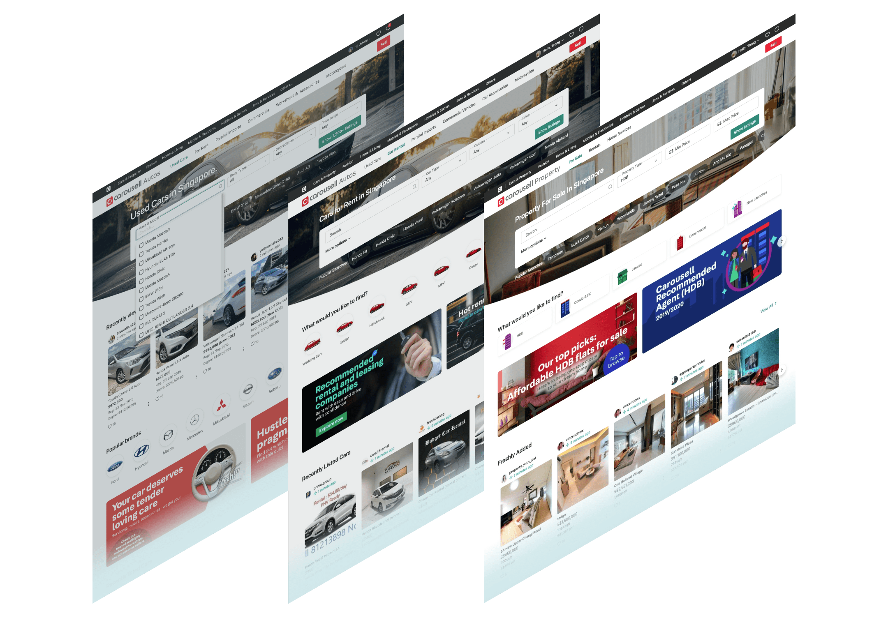
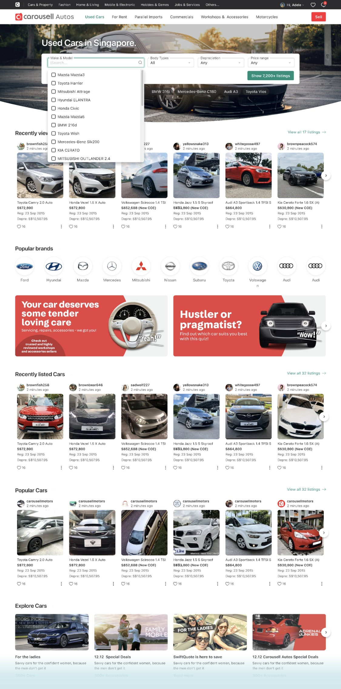
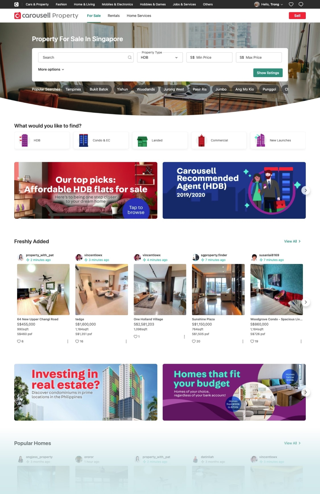
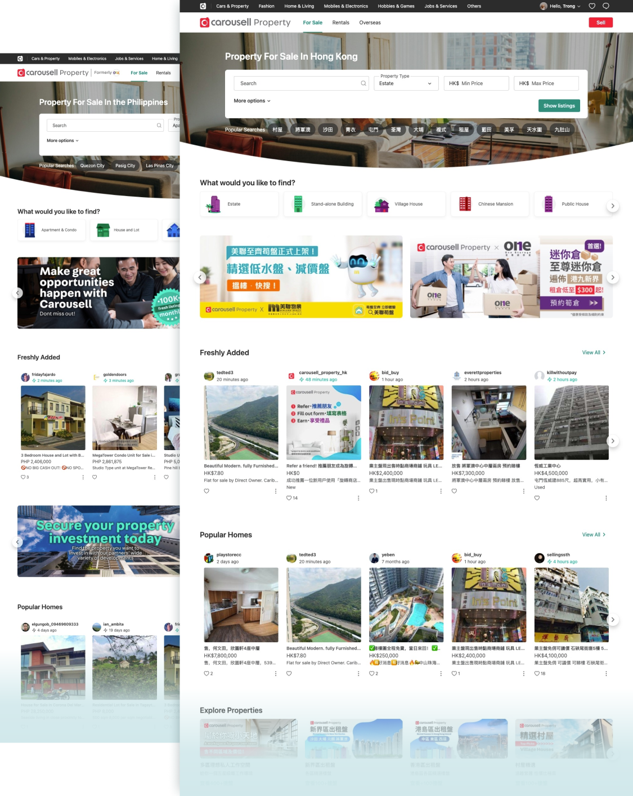
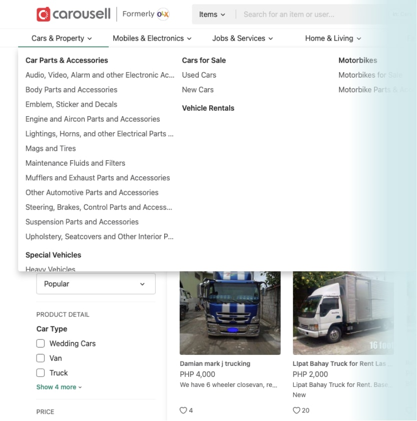
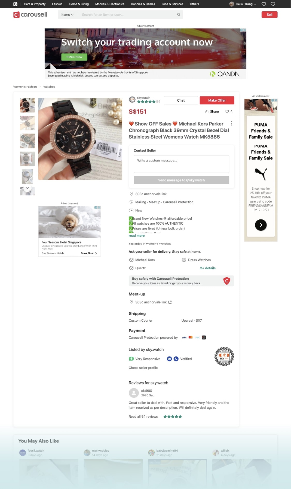
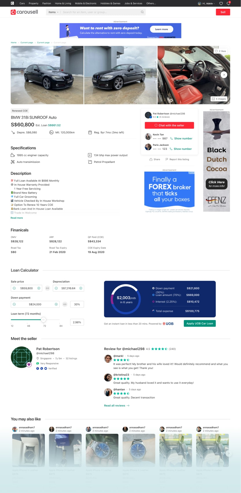
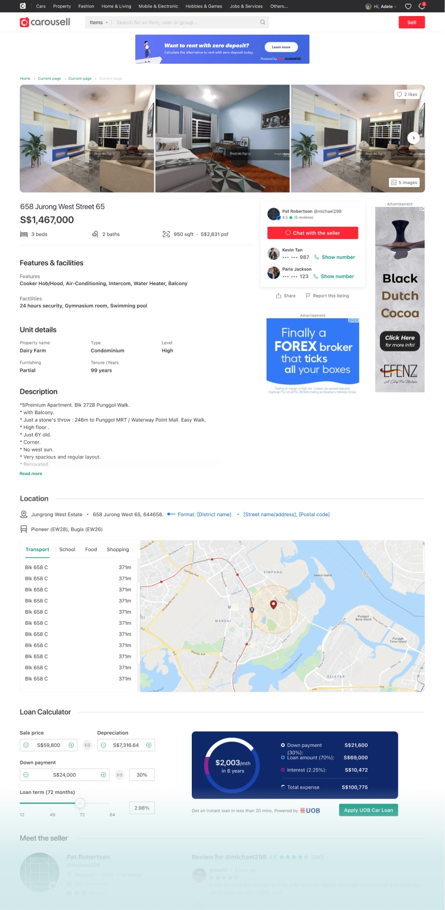
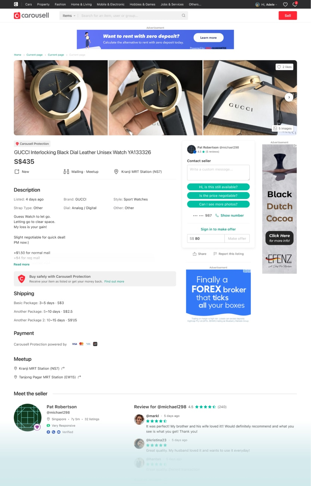
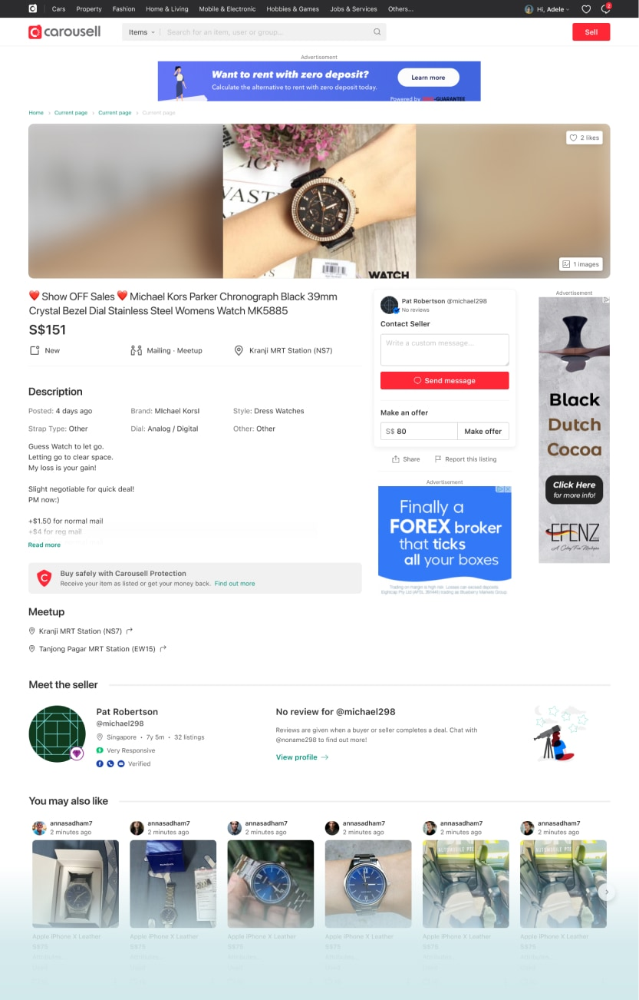

In 2019, Carousell paid more attention to the Web, especially for high-value categories like Cars and Property. This is the story of how I improved the buying experience on the web for vertical categories.

Platform: Web
Category: Cars, Property, Motor and Home service
Country: SG, PH, HK

Carousell is the biggest classifieds marketplace in Southeast Asia as of 2020, with 20+ million users across 7 major markets.

On Carousell, you can buy anything, from books, shoes, electronics to cars. But Cars and Property are the highest value categories, and their journeys are very different. So we decided to improve the experience to map better for that journey. For complex journeys, it helps to deep dive and comprehends the task better.

### My role
I led the design of the new web experience and collaborated with two other designers and a PM.

In addition, I worked closely with 5 engineers, clarified, discussed, and reviewed their PRs (Pull Request) to smoothen the development process.

The landing page launched in September 2020. The new listing detail is still in development. 

## Inheriting Legacy 
Not like other startups during the early days, Carousell started with the mobile applications, iOS and Android. Web, on the other hand, was treated and positioned as a secondary product. Most features were designed and built for mobile-first and later integrated into the web.

Cars and Property shoppers tend to do more of their browsing, research, buying on the web due to a large amount of information they need to consider.

So start of the 2020, we decided to focus more on the web, to build a better experience for web shoppers.

###### About the audience and market
## A closer understanding of Singapore car & home buyers
Singapore is physically small. This means that the number of cars and property allowed has to be properly controlled, so it’s very expensive.

From our user research, we learned that car and home buyers spend around 3 to 4 months on average researching online. Some even take up to one year to make a decision.

They usually have some specific criteria in mind. For car buyers, they start with a budget, make/offer, and registration year. For home buyers, they start with neighborhood, types, and budget. In a nutshell, they are power searchers.

### But not only for Singapore
Singapore is not the only market for cars and property, we also want to build a better experience for people in the Philippines, Hong Kong, and other countries in Southeast Asia.

So we think about a flexible landing page template with many different small components so we can customize for each country.

###### The process
## Challenge, idea, iterate and communicate
### The challenge
Our goal for the project is to make the web experience better for car and property buyers.

Our high-level goals were to make:
- A flexible landing page that works for both car and property, for different markets.
- A better place to open more opportunity for monetization and get more organic traffic.
- The new experience should stay unique with the whole Carousell.

### Ideas, iteration, and communication
At the early state of the project, I collaborated with two other designers, one designer from buyer experience, and another who is experienced in design for cars. Because we not only want to do the best for car and property but also make it work for the whole journey. From the time people come to Carousell, browse other categories, and come to our car/property categories.

With different perspectives, we came up with many different ideas. Some were different in layout, but some were different in direction. As the owner of the project, I had to find a way to harmonize different ideas from different people, but also convince them about what I believed is the best fit.

By having frequent syncs together every week, with open discussion and many iterate rounds, we worked much better together. Not only between designers, but we also did many meetings with PM, engineers, and stakeholders to get their feedback and alignment. The more we discuss, the clearer the direction and alignment.

From there, I dive into details.

---

###### The new web experience
## Introducing new landing page for Cars and Property
### Category landing pages
A new landing page aims to serve shoppers as a one-stop hub for all things auto-related — find a car for sale, rental, and accessories.

  

  

    

      When buying a used car, drivers usually have some criteria in mind. So the filter is the hero. Following are some sections for our business to promote campaigns.
    

  

  

    
    <figcaption>A new landing page for Cars</figcaption>
  

  

    

      Not only for cars, but the template is also flexible and customized for property where people can buy and rent houses.
    

  

  

    
    <figcaption>Landing page for property</figcaption>
  

  

    

      Because Carousell Cars/Property are not only for Singapore, we also launch it for the Philippines and Hong Kong
    

  

  

    
    <figcaption>Property landing page for Philippines and Hong Kong</figcaption>
  

  

    

      Due to the complexity, we don’t do responsive web. Instead, we separate desktop and mobile web experiences. So we can build a better experience for specific platform / device / behavior.
    

  

  

    <video autoplay loop muted playsinline src="./images/mobile-web-2.mp4"></video>
    <figcaption>Property landing page for Philippines and Hong Kong</figcaption>
  

People will look at us as one service, they don’t care that we have many different categories. We want to build a website that people navigate between different pages/categories easily. So we pushed more effort to rebuild the whole global navigation.

  

    
    <figcaption>Old global navigation</figcaption>
  

  

    <video autoplay loop muted playsinline src="./images/nav-3.mp4"></video>
    <figcaption>New improved global navigation</figcaption>
  

### A refined listing detail
Together with new landing pages, we also want to improve the experience for the highest traffic page: listing detail

  

    

      The current listing detail page has so many problems. It’s getting worse when other team added new features to the page without caring about the whole page. For expensive items like cars and property, where we need to show more info, the page is very bad.
    

  

  

    
    <figcaption>The current listing detail</figcaption>
  

##### Problems:
- Low CTR
- Lots of wasted space
- Difficult to add new information for expensive items
- Many bad UI elements

With many insights from the past and so many usability tests, I designed a new web listing detail with better design and flexible enough so it fits across diverse categories in Carousell.

  

    
    <figcaption>For Cars</figcaption>
  

  

    
    <figcaption>For property</figcaption>
  

  

    
    <figcaption>For watches, clothes, electronics,... for goods in general.</figcaption>
  

  

    
    <figcaption>And for items with only one image.</figcaption>
  

###### The impact
## Positive results and much more to do
…

It also opens more opportunities for monetization in each category where you could run targeted campaigns and ads, but still, ensure relevances in user experience.

*For confidentiality reasons I have omitted the actual values for these metrics.*

## Credit
My role: Designer Owner

Thanks for design feedbacks from folks: Felipe, Anh Pham, Keith, Jianyuan (PM).

Engineers: Andrew, Phat, Bui, Wilson, Jenny, and everyone else.